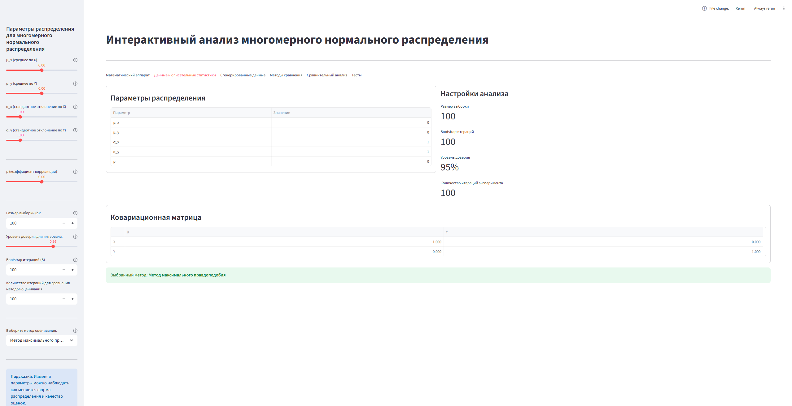
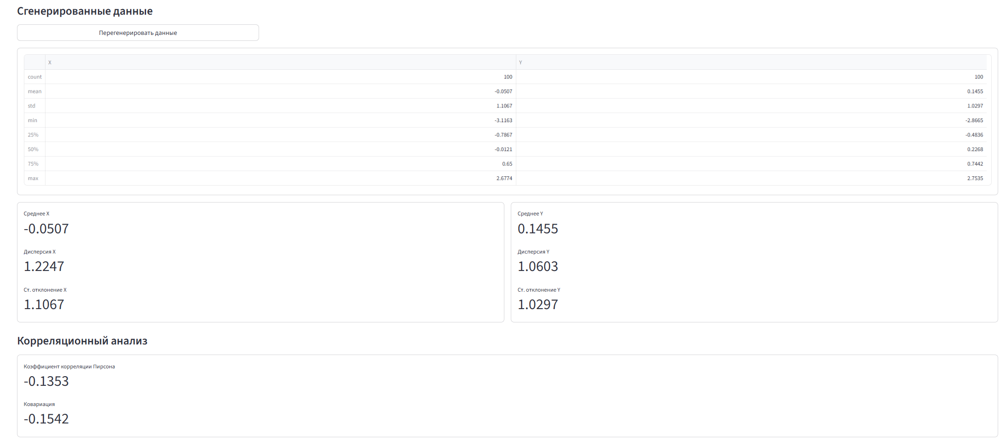
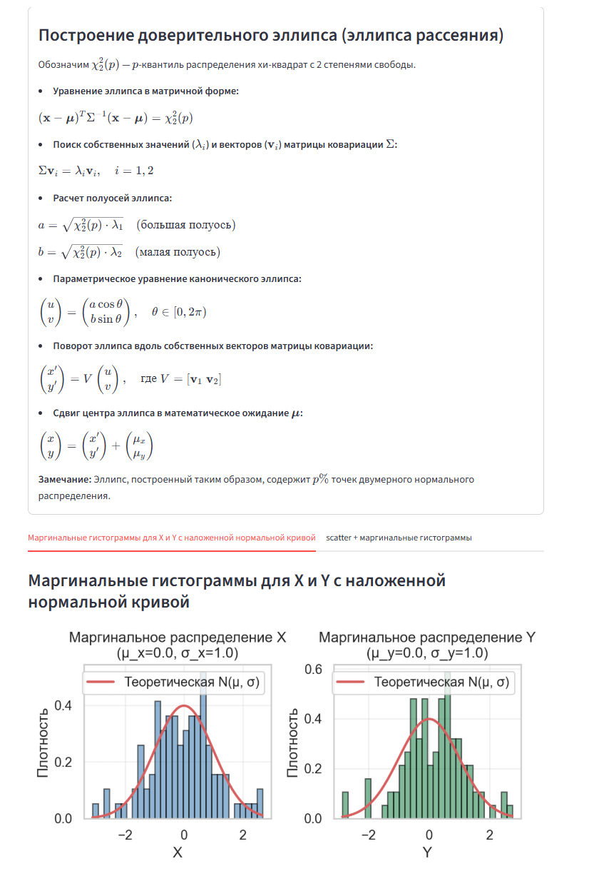
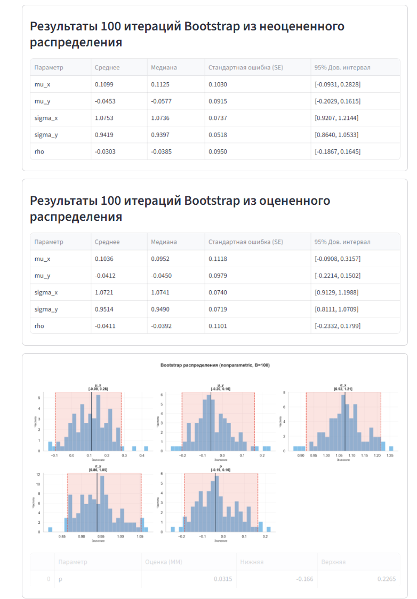
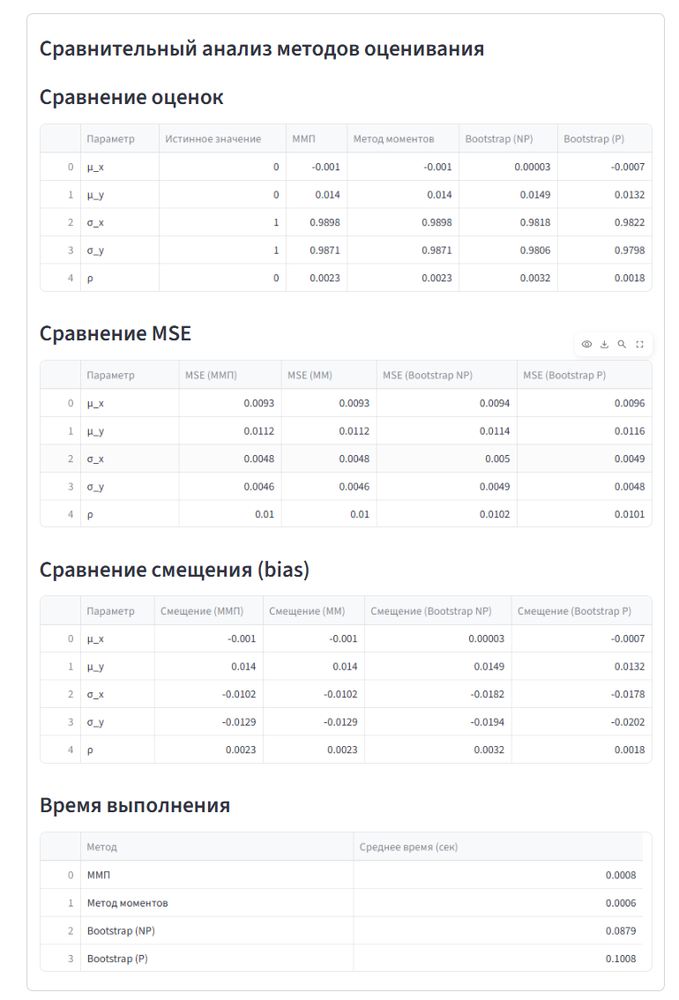
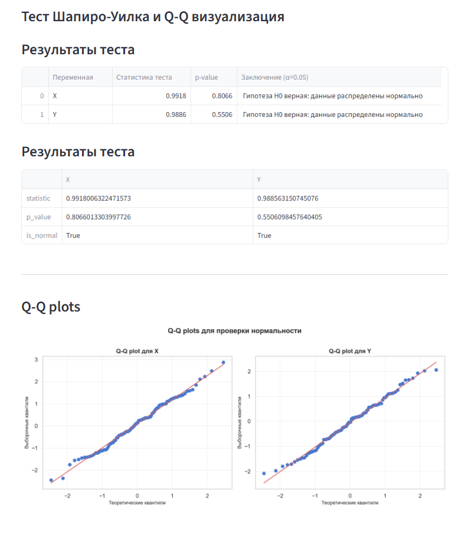

# Многомерное нормальное распределение

  

Интерактивный инструмент для исследования двумерного нормального распределения с фокусом на визуализацию, оценивание параметров и сравнительный анализ методов.

**Автор:** [Леонид Агарков](https://github.com)
**Статус:** Рабочий проект
**По вопросам и предложениям:**[homoest.123@gmail.com]

  

## Описание

Разработан интерактивный дашборд для исследования двумерного нормального распределения. Программа позволяет:

-  **Генерация данных** — создание выборок из двумерного нормального распределения через разложение Холецкого
-  **Визуализация** - доверительный эллипс, маргинальные гистограммы
-  **Оценивание параметров** — три метода: ММП, метод моментов, Bootstrap
-  **Анализ точности** — матрица Фишера, стандартные ошибки, доверительные интервалы
-  **Сравнительный анализ** — bias, variance, MSE, время выполнения
-  **Статистические тесты** — тест Шапиро-Уилка, Q-Q plots

  
  

## Пример работы








## Как использовать

1.  **Генерация данных** — настройте параметры распределения (μ, σ, ρ) и размер выборки
2.  **Визуализация** — исследуйте данные через точечный график и эллипсы
3.  **Оценивание** — выберите метод (ММП/ММ/Bootstrap) и сравните результаты
4.  **Анализ** — интерпретируйте доверительные интервалы и статистические тесты

  
## Математический аппарат

### 1. Плотность двумерного нормального распределения

$$
f(\mathbf{x}) = \frac{1}{2\pi\sqrt{|\Sigma|}} \exp\left( -\frac{1}{2} (\mathbf{x} - \boldsymbol{\mu})^T \Sigma^{-1} (\mathbf{x} - \boldsymbol{\mu}) \right)
$$

где:

- $\mathbf{x} = (x, y)^T$
- $\boldsymbol{\mu} = (\mu_x, \mu_y)^T$ — вектор средних
- $\Sigma$ — ковариационная матрица $2  \times  2$

  

### 2. Ковариационная матрица


$$\Sigma = \begin{bmatrix} \sigma_x^2 & \rho\sigma_x\sigma_y \\ \rho\sigma_x\sigma_y & \sigma_y^2 \end{bmatrix}$$

где:

- $\sigma_x^2, \sigma_y^2$ — дисперсии
- $\rho$ — коэффициент корреляции ($|\rho| \leq  1$)

### Математическая проверка ковариационной матрицы

**Определитель (детерминант):**

$$|\Sigma| = \sigma_x^2 \sigma_y^2 (1 - \rho^2)$$
  

**Критерии проверки матрицы:**

1.  **Положительно определённая матрица ($|\Sigma| > 0$)**

- $\sigma_x > 0, \quad  \sigma_y > 0, \quad |\rho| < 1$
- Распределение корректно. Существует обратная матрица $\Sigma^{-1}$. Точки образуют двумерное эллиптическое облако.

 
2.  **Вырожденная матрица ($|\Sigma| = 0$)**

- $|\rho| = 1$ ($\rho = 1$ или $\rho = -1$)
- Распределение вырождается в одномерное. Случайные величины связаны строгой линейной зависимостью, все сгенерированные точки лежат на одной прямой.

  
3.  **Невалидная матрица ($|\Sigma| < 0$)**

- $|\rho| > 1$
- Математически невозможная ситуация. Коэффициент корреляции не может превышать единицу по модулю.

  
### 3. Параметры распределения

  
Всего 5 параметров: $\boldsymbol{\theta} = (\mu_x, \mu_y, \sigma_x, \sigma_y, \rho)$

### 4. Генерация точек (сэмплирование)


**Метод: Разложение Холецкого**

- $\Sigma = L L^T$, где $L$ — нижняя треугольная матрица

- $\mathbf{X} = \boldsymbol{\mu} + L \mathbf{Z}$, где $\mathbf{Z} \sim  \mathcal{N}(0, I)$

**Матрица Холецкого:**

$$L = \begin{bmatrix} \sigma_x & 0 \\ \rho\sigma_y & \sigma_y\sqrt{1 - \rho^2} \end{bmatrix}$$
  

**Покомпонентная генерация:**

$$ \begin{aligned} X &= \mu_x + \sigma_x Z_1 \\ Y &= \mu_y + \rho \sigma_y Z_1 + \sigma_y \sqrt{1 - \rho^2} Z_2 \end{aligned} $$
  

### 5. Построение доверительного эллипса (эллипса рассеяния)


Обозначим $\chi^2_{2}(p)$ — $p$-квантиль распределения хи-квадрат с 2 степенями свободы.

**Уравнение эллипса в матричной форме:**

$$(\mathbf{x} - \boldsymbol{\mu})^T \Sigma^{-1} (\mathbf{x} - \boldsymbol{\mu}) = \chi^2_{2}(p)$$
  

**Поиск собственных значений ($\lambda_i$) и векторов ($\mathbf{v}_i$) матрицы ковариации $\Sigma$:**

$$\Sigma \mathbf{v}_i = \lambda_i \mathbf{v}_i, \quad i = 1, 2$$

**Расчет полуосей эллипса:**

$$ \begin{aligned} a &= \sqrt{\chi^2_{2}(p) \cdot \lambda_1} \quad \text{(большая полуось)} \\ b &= \sqrt{\chi^2_{2}(p) \cdot \lambda_2} \quad \text{(малая полуось)} \end{aligned} $$

  

**Параметрическое уравнение канонического эллипса:**

$$ \begin{pmatrix} u \\ v \end{pmatrix} = \begin{pmatrix} a \cos t \\ b \sin t \end{pmatrix}, \quad t \in [0, 2\pi) $$
  

**Поворот эллипса вдоль собственных векторов матрицы ковариации:**

$$ \begin{pmatrix} x' \\ y' \end{pmatrix} = V \begin{pmatrix} u \\ v \end{pmatrix}, \quad \text{где } V = [\mathbf{v}_1 \; \mathbf{v}_2] $$

**Сдвиг центра эллипса в математическое ожидание $\boldsymbol{\mu}$:**

$$ \begin{pmatrix} x \\ y \end{pmatrix} = \begin{pmatrix} x' \\ y' \end{pmatrix} + \begin{pmatrix} \mu_x \\ \mu_y \end{pmatrix} $$ > **Замечание:** Эллипс, построенный таким образом, содержит $p \cdot 100\%$ точек двумерного нормального распределения.

---

## Методы оценивания


### 1. Метод максимального правдоподобия (ММП)

### Оценки параметров

**Средние значения:**

$$
\hat{\mu}_x = \frac{1}{n} \sum_{i=1}^{n} x_i
$$

$$
\hat{\mu}_y = \frac{1}{n} \sum_{i=1}^{n} y_i
$$

**Центрированные данные:**

$$
x_{c,i} = x_i - \hat{\mu}_x
$$

$$
y_{c,i} = y_i - \hat{\mu}_y
$$

**Дисперсия:**

$$
\hat{\sigma}_x^{2,\text{ММП}} = \frac{1}{n} \sum_{i=1}^{n} (x_i - \hat{\mu}_x)^2
$$

$$
\hat{\sigma}_y^{2,\text{ММП}} = \frac{1}{n} \sum_{i=1}^{n} (y_i - \hat{\mu}_y)^2
$$

**Стандартное отклонение:**

$$
\hat{\sigma}_x = \sqrt{\hat{\sigma}_x^{2,\text{ММП}}}
$$

$$
\hat{\sigma}_y = \sqrt{\hat{\sigma}_y^{2,\text{ММП}}}
$$

**Ковариация:**

$$
\hat{\text{cov}}_{xy}^{\text{ММП}} = \frac{1}{n} \sum_{i=1}^{n} (x_i - \hat{\mu}_x)(y_i - \hat{\mu}_y)
$$

**Корреляция:**

$$
\hat{\rho}^{\text{ММП}} = \frac{\sum_{i=1}^{n} (x_i - \hat{\mu}_x)(y_i - \hat{\mu}_y)}{\sqrt{\sum_{i=1}^{n} (x_i - \hat{\mu}_x)^2  \sum_{i=1}^{n} (y_i - \hat{\mu}_y)^2}}
$$

**Стандартные ошибки оценок через информацию Фишера:**

$$
\text{se}(\hat{\mu}_x) = \frac{\hat{\sigma}_x}{\sqrt{n}}
$$

$$
\text{se}(\hat{\mu}_y) = \frac{\hat{\sigma}_y}{\sqrt{n}}
$$

$$
\text{se}(\hat{\sigma}_x) = \frac{\hat{\sigma}_x}{\sqrt{2n}}
$$

$$
\text{se}(\hat{\sigma}_y) = \frac{\hat{\sigma}_y}{\sqrt{2n}}
$$

$$
\text{se}(\hat{\rho}) = \frac{1 - \hat{\rho}^2}{\sqrt{n}}
$$

  
**Критическое значение (квантиль):**

$$
\alpha = 1 - \gamma
$$

$$
z_{1 - \alpha/2} = \Phi^{-1} \left(1 - \frac{\alpha}{2}\right)
$$

### Информационная матрица Фишера

Для параметров $\boldsymbol{\theta} = (\mu_x, \mu_y, \sigma_x, \sigma_y, \rho)$ информационная матрица Фишера имеет блочно-диагональную структуру:

$$
\mathcal{I}(\boldsymbol{\theta}) = \begin{pmatrix}
\mathcal{I}_{\boldsymbol{\mu}\boldsymbol{\mu}} & 0 \\
0 & \mathcal{I}_{\boldsymbol{\Sigma}\boldsymbol{\Sigma}}
\end{pmatrix}
$$

**Блок для средних:**

$$
\mathcal{I}_{\boldsymbol{\mu}\boldsymbol{\mu}} = \begin{pmatrix}
\frac{n}{\sigma_x^2(1-\rho^2)} & \frac{n\rho}{\sigma_x\sigma_y(1-\rho^2)} \\
\frac{n\rho}{\sigma_x\sigma_y(1-\rho^2)} & \frac{n}{\sigma_y^2(1-\rho^2)}
\end{pmatrix}
$$

**Блок для параметров ковариации:**

$$
\mathcal{I}_{\boldsymbol{\Sigma}\boldsymbol{\Sigma}} = \begin{pmatrix}
\frac{2n}{\sigma_x^2} & \frac{2n\rho^2}{\sigma_x\sigma_y} & -\frac{2n\rho}{\sigma_x\sqrt{1-\rho^2}} \\
\frac{2n\rho^2}{\sigma_x\sigma_y} & \frac{2n}{\sigma_y^2} & -\frac{2n\rho}{\sigma_y\sqrt{1-\rho^2}} \\
-\frac{2n\rho}{\sigma_x\sqrt{1-\rho^2}} & -\frac{2n\rho}{\sigma_y\sqrt{1-\rho^2}} & \frac{n(1+\rho^2)}{(1-\rho^2)^2}
\end{pmatrix}
$$

  
**Обратная матрица Фишера (ковариационная матрица оценок):**

$$
\mathcal{I}^{-1}(\boldsymbol{\theta}) = \text{Cov}(\hat{\boldsymbol{\theta}})
$$

**Асимптотические доверительные интервалы:**

$$
\hat{\theta}_i \pm z_{1-\alpha/2} \cdot  \text{se}(\hat{\theta}_i)
$$


### Логарифм функции правдоподобия

$$ \ln L(\mu_x, \mu_y, \sigma_x, \sigma_y, \rho) = -n\ln(2\pi) - n\ln(\sigma_x) - n\ln(\sigma_y) - \frac{n}{2}\ln(1-\rho^2) - \frac{1}{2(1-\rho^2)} \sum_{i=1}^{n} \left[ \frac{(x_i - \mu_x)^2}{\sigma_x^2} - \frac{2\rho(x_i - \mu_x)(y_i - \mu_y)}{\sigma_x\sigma_y} + \frac{(y_i - \mu_y)^2}{\sigma_y^2} \right] $$

  
### 2. Метод моментов (ММ)

Приравнивание выборочных и теоретических моментов:

- Первые моменты: $\hat{\mu}_x^{\text{MM}} = \bar{x}, \quad  \hat{\mu}_y^{\text{MM}} = \bar{y}$

- Вторые центральные моменты:

$$ \begin{aligned} \hat{\sigma}_x^{2,\text{MM}} &= \frac{1}{n} \sum_{i=1}^n (x_i - \bar{x})^2 \\ \hat{\sigma}_y^{2,\text{MM}} &= \frac{1}{n} \sum_{i=1}^n (y_i - \bar{y})^2 \\ \hat{\rho}^{\text{MM}} &= \frac{\sum_{i=1}^n (x_i - \bar{x})(y_i - \bar{y})}{\sqrt{\sum_{i=1}^n (x_i - \bar{x})^2 \sum_{i=1}^n (y_i - \bar{y})^2}} \end{aligned} $$ > **Замечание:** Для нормального распределения ММП и ММ совпадают для первых двух моментов.

  

### 3. Bootstrap метод

**Non-parametric bootstrap:**

- Генерация $B$ псевдовыборок путём сэмплирования с возвращением из исходных данных
- Для каждой псевдовыборки вычисляются оценки параметров
- Построение доверительных интервалов (процентильный метод)

**Parametric bootstrap:**

- Генерация $B$ выборок из оценённого распределения $\mathcal{N}(\hat{\boldsymbol{\mu}}, \hat{\Sigma})$
- Оценка параметров на каждой выборке
- Сравнение с аналитическими интервалами из матрицы Фишера

**Bootstrap доверительный интервал (процентильный):**

$$[\hat{\theta}^*_{(\alpha/2)}, \hat{\theta}^*_{(1-\alpha/2)}]$$

---

## Критерии сравнения методов

1.  **Смещение (bias):** $\text{Bias}(\hat{\theta}) = \mathbb{E}[\hat{\theta}] - \theta$
2.  **Дисперсия (variance):** $\text{Var}(\hat{\theta})$
3.  **Среднеквадратичная ошибка (MSE):** $\text{MSE} = \text{Bias}^2 + \text{Var}$
4.  **Доверительные интервалы:** длина
5.  **Вычислительная сложность:** время выполнения

---
## Статистические тесты

**Тест Шапиро — Уилка**— это статистический критерий для **проверки выборки на нормальность распределения**. Он оценивает, насколько собранные данные близки к теоретической нормальной (гауссовой) кривой.
* **Нулевая гипотеза (H₀)**: Данные распределены **нормально**.
*  **Альтернативная гипотеза (H₁)**: Данные **отличаются** от нормального распределения.

При проведении теста программа рассчитывает статистику критерия W и уровень значимости p-value. 
- **Если p > 0.05**: Нет оснований отвергать нулевую гипотезу. Распределение данных можно считать **нормальным**.  
- **Если p ≤ 0.05**: Нулевая гипотеза отвергается. Данные **значительно отклоняются** от нормальных. 
**Статистика теста (W) принимает значения в диапазоне от 0 до 1:**
$$W = \frac{\left(\sum_{i=1}^n a_i x_{(i)}\right)^2}{\sum_{i=1}^n (x_i - \bar{x})^2}$$

---
**Q-Q plot** (квантиль-квантиль) — это график для **визуальной проверки** распределения данных на нормальность. Он сравнивает квантили ваших реальных данных с квантили идеального теоретического нормального распределения.


## Структура проекта
 
.
├── dashboard.py
├── math_content.py
├── pytest.ini
├── README.md
├── requirements.txt
├── src/
│ ├── comparison.py
│ ├── data_generator.py
│ ├── statistical_tests.py
│ ├── visual.py
│ └── evaluation/
│ ├── bootstrap.py
│ ├── mle_estimator.py
│ └── mm_estimator.py
└── tests/
├── test_data_generator.py
├── test_statistical_tests.py
└── __init__.py

  

## Запуск

1. Клонируйте репозиторий проекта

```bash
git  clone  https://github.com/Leonid2005ponchik/MND-interactive
cd  MND-interactive
```

2. Установите зависимости:

```bash
pip  install  -r  requirements.txt
```

3. Запустите дашборд:

```bash
streamlit  run  dashboard.py
```

## Тестирование

**Для проверки корректности работы модулей в проекте реализованы unit-тесты с использованием pytest.**

```bash
pytest  tests/  -v
```

## Технологии

| Технология | Назначение |
| :--- | :--- |
| **Python 3.8+** | Язык программирования |
| **Streamlit** | Фреймворк для создания дашбордов |
| **NumPy** | Работа с массивами и матрицами |
| **Pandas** | Работа с данными |
| **SciPy** | Статистические вычисления |
| **Matplotlib / Seaborn** | Визуализация |
| **Pytest** | Unit-тестирование |

## Лицензия

- MIT

## Как помочь проекту

1. Сообщайте об ошибках в Issues
2. Предлагайте новые функции
3. Делитесь проектом в соцсетях